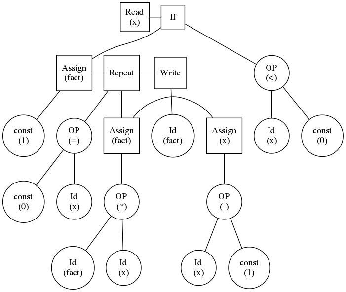

# Tinny Programming Language Parser

A Simple Parser for Tiny Language Using <b>Python</b>
<hr>


### OS :
Ubuntu 18.04 xubuntu dist.


<p>Write the command to write the output from the tiny programming language in <strong>syntax_tree_output.png</strong></p> 

```c++
cd dist/parser/
./parser
```
Then enter the name of the file or you can press enter and it will take the file with name <strong>tiny_sample_code.txt</strong>

### NOTE :
the tiny programming file must be in the same directory in the parser folder or if you don't want to copy one just open <b>tiny_sample_code.txt</b> and write your code and run the pervious commands.